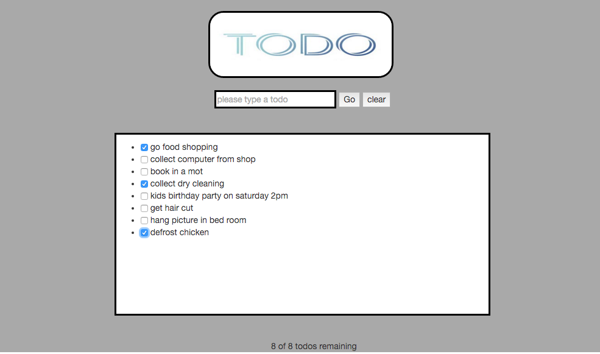

### Instructions



To download my repo
```
$ git clone https://github.com/jrose111284/todo_challenge
```
Now run ..
```
$ bower install
$ npm install
```
If you want to see my app working..
```
open index.html
```

To test unit test with karma
```
$ karma start test/karma.conf.js
```
Here is how you test my feature test with protractor
please follow these commands
```
$ webdriver-manager start
$ http-server
```
make sure http server and webdriver are running in another terminal window

Now you can run in a new terminal window make sure you in the correct directory
```
$ protractor test/e2e/conf.js
```
What i didnt complete!

tried to deploy to heroku keeped getting this error

```
remote:        We're sorry this build is failing! You can troubleshoot common issues here:
remote:        https://devcenter.heroku.com/articles/troubleshooting-node-deploys
remote:
remote:        Some possible problems:
remote:
remote:        - Node version not specified in package.json
remote:        https://devcenter.heroku.com/articles/nodejs-support#specifying-a-node-js-version
remote:
remote:        - Bower may not be tracked in package.json
remote:        https://devcenter.heroku.com/articles/troubleshooting-node-deploys#ensure-you-aren-t-relying-on-untracked-dependencies
remote:
```

Think it something to do with my npm package.json. Ran out of time this weekend will try and fix issue soon.
# Todo Challenge

* Deadline: submit completed pull request by 9am on Monday
* You may use whatever level of JavaScript you feel comfortable with - pure JS, jQuery, Angular, or whatever weird and wonderful framework you want to try. Extra points for DogeScript

Steps
-------

1. Fill out your learning plan self review for the week: https://github.com/makersacademy/learning_plan
2. Fork this repo, and clone to your local machine
3. Complete the following challenge:

## Challenge


Build a Todo list as a mini front-end application. You don't have to use a database, the front-end is more important - you can use an appropriate data structure stored somewhere in your JavaScript (this time only!)

Here are the core user stories:

```
As a forgetful person
I want to store my tasks
So that I don't forget them

As a person with limited time
I want to instantly be able to update my todo list (adding and changing entries)
So that I have more time to think about other things

As a person who actually gets stuff done
I want to mark my tasks as done
So that I don't do them twice
```

Here are some other user stories you may choose to implement:

```
As a person with a lot of tasks
I want to be able to filter my tasks by "All", "Active", "Complete"
So that I only see the relevant tasks

As a person who doesn't like counting by hand
I want to see a total number of tasks
So that I don't have to count

As someone who has done lots of stuff
I want to be able to clear my completed tasks
So I never see them again
```

As you may imagine, implementing a To-do list is very much a solved problem. However, we are mainly interested in seeing how you approach testing and design. We are looking for:

* well written, well structured acceptance and unit tests
* clear and expressive JavaScript
* good HTML5 markup

Don't worry about deployment, and make sure you read the CONTRIBUTING.md when submitting a pull request.

## Extensions

* Deploy the app
* Create a persistance layer (e.g. MongoDB), or use LocalStorage or the filesystem through Node
* Make it look purdy (CSS) - try a framework like Bootstrap or Foundation

## CI

Read the `.travis.yml` if any of the steps below don't make sense!

* Make sure you have set up `npm test` in your `package.json` so that it runs your Karma tests
* Make sure you have your Protractor config file at `e2e/conf.js`
* Make sure `npm start` spins up whatever serves up your app - `http-server`, Sinatra or Node

Good luck!
